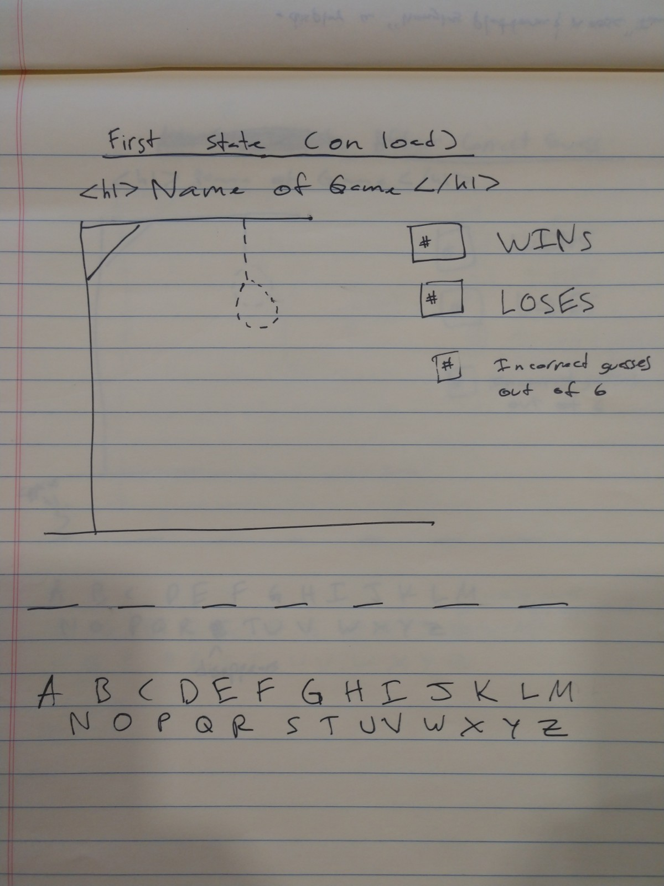
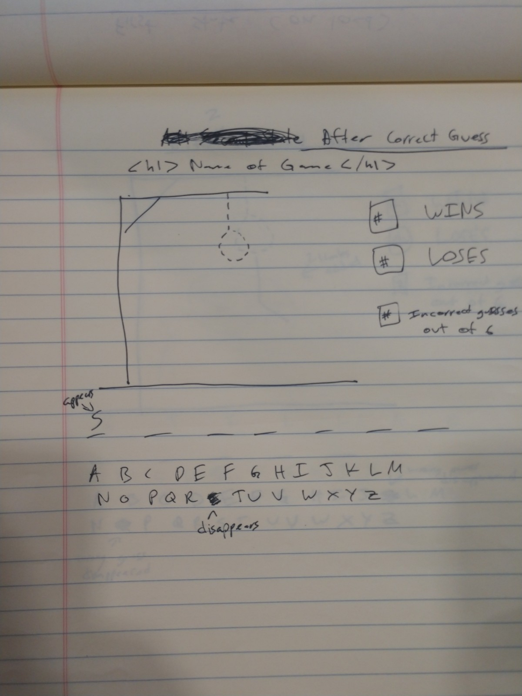
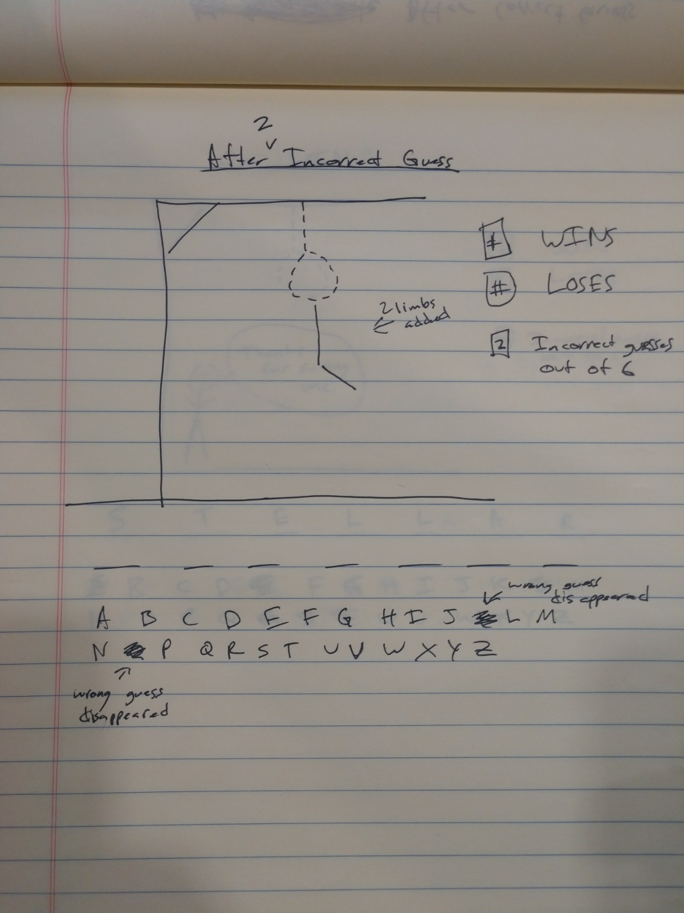
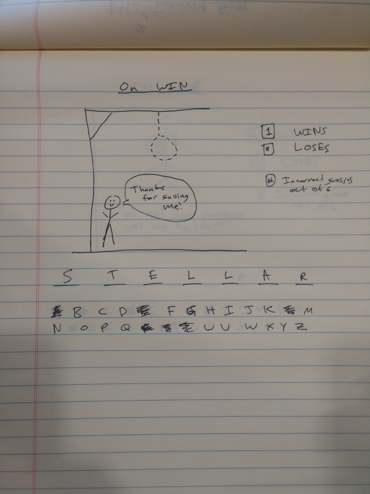
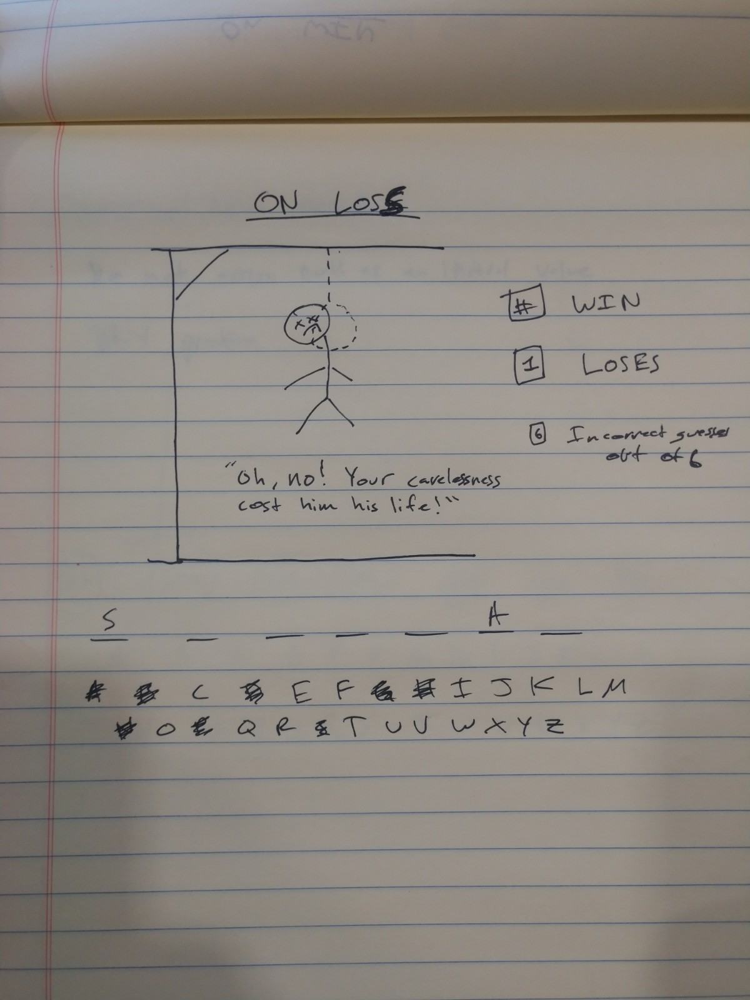
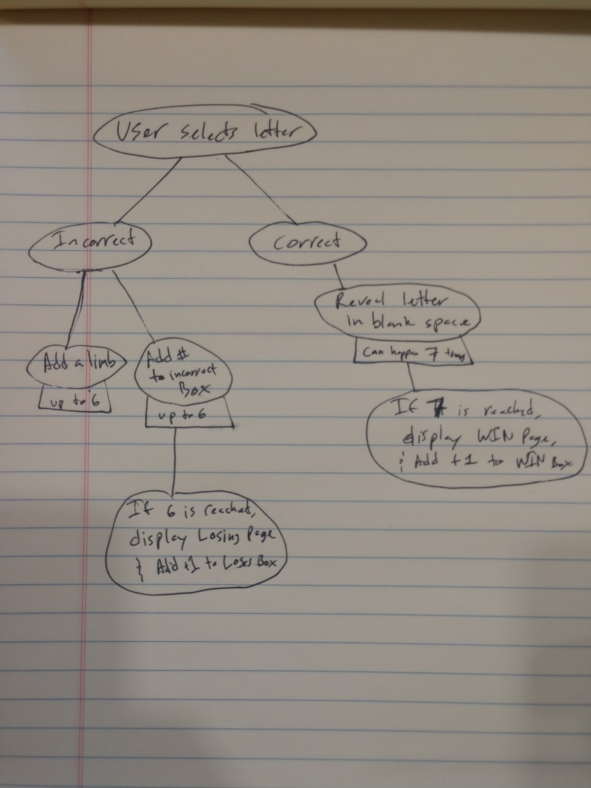

**PROJECT DESCRIPTION**

This is a simple game of hangman! Yosemite Sam Hangman is a guessing game where you must select letters of the alphabet to complete puzzle of a missing word.

**Below is a link to the game itself**

https://cameron-bret.github.io/Yosemite-Sam-Hangman/

**Below is a link to the Trello Board**

https://trello.com/b/b27rfMm7/c-bret-nichols-hangman-game

**Below is a link to the wireframe images for the game**

**Below is a list of technologies/libraries/frameworks and resources... think of this section as a citation of sources**

jQuery, Bootstrap, Pexel.com (stock images), Rosewood fonts
Designed by Carl Crossgrove, Carol Twombly, and Kim Buker Chansler. From Adobe Originals., I asked a question on Stack Overflow and was answered by Tina Holly https://stackoverflow.com/questions/53807898/show-item-at-random-from-one-array-when-another-separate-item-in-a-different-arr , http://advenutres-of-powerpuff-girls-z.wikia.com/wiki/File:Yosemite_Sam.png (winning yosemite sam pic), https://www.dawgshed.com/threads/wags-got-a-tattoo.216176/ (losing yosemite sam pic)

**Below is a list of goals for version 2**

version 2 goal: decrease image sizes and resolutions to increase load time.
version 2 goal: make a tumble weed blow by periodically.
version 2 goal: make the noose swing.
version 2 goal: scoreboard with number of won, lost, and wrong displayed to side.
version 2 goal: update and modify end game functionality.
version 2 goal: add more playable words.
version 2 goal: add flavicon to site.
version 2 goal: add interactive sounds.

**Special Thanks**

Daniel Mishael
Conrad Casper
Andrew McIntosh
William Njie
JB Watson
Shalain Deramus
Cameron Gunter
Stanley Kimani
Spencer Merryman
Noah Harvey

for inspiration, motivation, and guidance along the way!